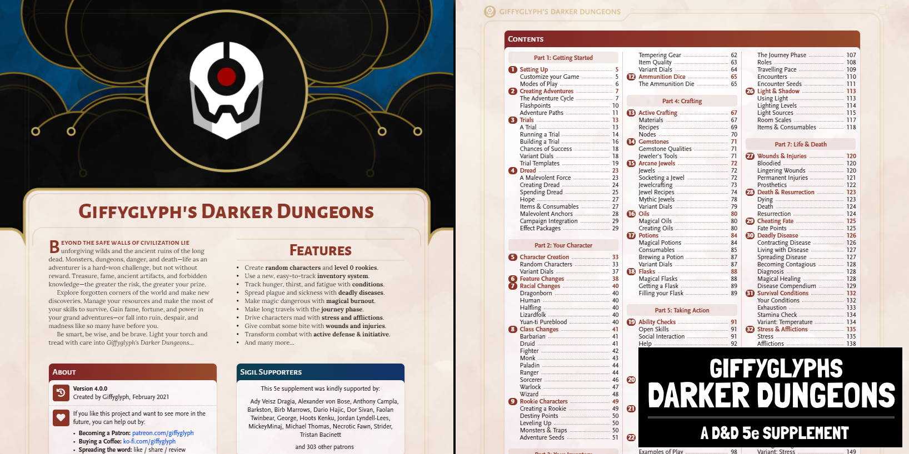

# Changelog

## v4.0.0
* New chapter: Dread (p23-31)
* New PDF sheet: Trials (p172)

## v3.1.0
* New chapter: Trials (p7-12)
* Restored chapter: Quick Reference (p48-51)

## v3.0.0
* New chapter: Creating Adventures (p7-12)
* New chapter: Active Crafting (p48-51)
* New chapter: Gemstones (p52)
* New chapter: Arcane Jewels (p53-60)
* Total rewrite: Active Inventory (p52)
* Total rewrite: Oils (p61-64)
* Total rewrite: Potions (p65-69)
* Full visual update, higher-quality page art and layout.
* Minor text tweaks and corrections across the document.

## v2.2.0
* New chapter: Class Changes for barbarian/druid/fighter/monk/paladin/ranger/sorcerer/warlock/wizard (p17-24)
* New chapter: Light & Shadow, rules to manage light without distance tracking (p67-72)
* New content: Added variant options to Wear & Tear (p35)
* New content: Added example consumables to Potions (p39)
* New content: Added variant options to Dangerous Magic (p59)
* New content: Added consumables and variant options to Stress & Afflictions (p93-94)
* Fixed: Corrected animal slots and equipment pack sizes (p28)
* Fixed: Darkened grey text on character sheets (p115-127)

## v2.1.0
* Revised rookies chapter and added 10 adventure seeds (p11-13)
* New chapter: Potions (p29-30)
* New chapter: Flasks (p31-32)
* New chapter: Oils (p33-34)
* Added grid-equipment pages (p101-103)
* Reduced stress healing from camp activities
* Removed automatic rations from long rest
* Revised mana potion costs to be inline with healing potions
* Various typo and example corrections.
* Update page and table styles.

## v2.0.0
* Layout and Art: Full revamp of page layout, font styles, and art.
* Character Creation: Added low/average/high starting wealth options.
  * Moved feature changes into "feature changes" chapter.
  * Added a new page of creation options for customisation (roll options/arrays/feats/etc).
* Rookie characters: New chapter, rules for level-0 characters.
* Feature changes: New chapter, collection of feature/spell tweaks.
* Race changes: New chapter, collection of race tweaks for dragonborn/human/halfling/lizardfolk/yuan-ti.
* Class changes: New chapter, collection of class tweaks for druid/paladin/ranger/warlock.
* Inventory Space: New chapter, moved from old "Equipment" chapter.
  * Armor expertise now uses proficiency bonus (credit LeVentNoir).
  * Added costs and basic armor/weapon details to equipment tables.
* Wear and Tear: New chapter, moved from old "Equipment" chapter.
  * Added shattering mechanic and maximum notches.
  * Improved/clarified functionality of mending spell.
* Ammunition: New chapter, moved from old "Equipment" chapter.
* Active defence: New chapter, moved from old "Taking Action" chapter.
  * Added notes on using portent.
  * Added smaller defence variant.
  * Added massive damage variant to saving attacks.
* Active Initiative: New chapter, moved from old "Taking Action" chapter.
  * Clarified how a round works with extra details.
* Degrees of Success: New chapter, moved from old "Taking Action" chapter.
  * Added table of boons.
  * Added table of offerings for success-at-a-cost.
* Dangerous magic: Updated consequences.
* Making a Journey: Added random tables of 10 skill challenges and 50 discoveries.
* Wounds & Injuries: New chapter, contains wound effects.
  * Simplified wounds, now based on exhaustion.
  * Added rules/support for prosthetics.
* Death & Resurrection: New chapter, added "Dying" condition.
  * Added milestone variant for funeral rewards.
* Cheating Fate: New chapter, expanded details on spending/gaining fate.
* Survival Conditions: Added temperature variant.
* Stress & Afflictions: Reduced stress from 200 points to 40.
  * Reduced stress penalties from 5/10/20/40 to 1/2/4/8.
  * Added roll variants.
  * Revised afflictions table with brand new effects.
* Short Rest: New chapter, contains short rest and camping details.
* Long Rest: New chapter, contains long rest details.
  * Added example random rumor table.
* Leveling Up: Added faster training variant.
  * Added variant locations as a mentor replacement.
* Random Tables: Added animals for Wild Shape reference.
* Sheets & Trackers: New chapter, collection of sheets, trackers, and reference pages.
  * Added brand new character sheet.
  * Added new equipment tracker.
  * Added new journey tracker.
  * Added new calendar.
  * Added quick reference.

## v1.7.0
* Clarified language/intelligence restrictions on character generation (p8).
* Equipment now uses item slots as a base measurement, not containers (p14).
* Added a quickdraw rules variant (p17).
* Added a containers rules variant. Container size can now be specified by the player. Removed the purse container type (p18).
* Potion toxicity now drains hit dice instead of applying Stress (p20).
* Conditions has had a full rewrite: removed health/light/temperature conditions and connected hunger/thirst/fatigue directly to exhaustion (p27).
* Clarified how to improve/afflict conditions (p28).
* Made stamina checks a variant rule. Checks are now based on the character's best condition DC (p28).
* Clarified language around Stress; characters now gain and heal stress (p29-32).
* Added Stress heal to Calm Emotions spell (p31).
* Rewrote the dangerous magic burnout table: added more possibilities and removed stress/condition assumptions (p34).
* Added a section on custom burnout effects (p35).
* Full rewrite of the camping phase (p45).
* Added a setting-up-camp group skill check that determines the difficulty of all in-camp activities (p45).
* Added brewing as a camp activity (p46).
* Hit dice can now be restored by cooking/brewing/sleeping (p46).
* Some camp activities now reward inspiration (p46).
* Clarified that the lookout has time to sleep (p47).
* Added a section to clarify ambushes during camp (p47).
* Moved conditions/stress into defined variants (p48).
* Added notes on camp-relevant magic spells (p48).
* Decreased lifestyle costs per week a fraction (p49).
* Lifestyle now affects maximum HP (p49).
* Added a section on property ownership affecting lifestyle costs (p50).
* Added exhaustion to character sheet (p66).
* Added a simplified inventory character sheet (p67).
* Added extra fields to the magic character sheet (p69).
* Health/Light/Temperature conditions removed, to be reworked in 1.7.1.

## v1.6.0
* Added chapters: Active XP, Changelog.
* Complete rewrite and update of all styles and artwork. Removed all Darkest Dungeon artwork as I don't own it.
* Ammunition & Burnout die now trigger on 1 or 2.
* Negative STR modifiers now affect inventory capacity.
* All medium and heavy armor now reduces non-magical damage.
* Renamed Stygian mode to Astral.
* Added an example for rolling ability scores.
* Added random generators for family and memories.
* Added tables and examples for known languages.
* Split leveling chapter into two chapters to better focus on training and XP. Added examples to generate XP.
* Added mentor response generator.
* Initiative now uses INT instead of DEX.
* A helping player now rolls one of the two d20.
* When using Active Initiative, taking damage allows you to interrupt for free.
* Added an example for using Open Skills.

## v1.5.0
* Added chapter: Deadly Diseases.
* Added new races and subraces from MToE.
* Added equipment tempering.
* Added encounter seeds to "Making a Journey".
* Added an inventory page to the character sheet.

## v1.4.0
* Added chapter: Dangerous Magic.
* Added quick reference guide.
* Added examples to Life & Death and Rest chapters.
* Added guidelines for resurrection magic.
* Ammunition is now tracked using ammunition dice.

## v1.3.0
* Grouped main features into different modes of play: Radiant, Dark, and Stygian.
* Separated Conditions from Stress & Afflictions.
* Added new equipment examples and guidelines for magical containers.
* Added examples to the action changes in Chapter 4.
* Added missing XGtE spells to the tables in Appendix A.
* Expanded FAQ with some new questions.

## v1.2.0
* Added chapters: NPC Economy, FAQ.
* Added new races and specialisations from XGtE & VGtM.
* Magic users can now chose their spells manually as usual for their class.
* Inventory size is now modified by character size.
* Added equipment size tables.
* Added spells, notes, and templates to character sheets.
* Added examples for equipping characters and conditions.

## v1.1.0
* Added chapters: Preface, Making a Journey.
* Magic users can now chose one cantrip and one spell when generating their first-level spell list.
* Added experience tables to help calculate discovery and treasure XP rewards.
* Fate points are now capped at 3.
* Split lingering physical effects into minor wounds and major injuries—dragons and other vicious creatures now stand a chance of tearing off a character's limb.
* Added descriptions to the categories of Stress.
* Characters now gain an Affliction at 100, 150, and 175 Stress—up from just 100.
* Reaching a sanctuary now automatically reduces and caps Stress to 75.
* Greater Restoration spells can now be used to help remove character Afflictions.
* Made Intelligence and Wisdom more useful in social situations by focusing on the context of the interaction—similarly, de-emphasised Charisma.
* Added inventory container categories.
* Added vehicle inventory capacities.
* Item quality now affects item resale value.
* Clarified the timing of events during the long rest phase.
* Added character sheets with new sections to accommodate the stress and inventory systems.

## v1.0.0
* Added chapters: Character Creation, Leveling Up, Equipment, Taking Action, Stressing Out, Life & Death, Rest & Downtime.
* Added appendix: Random Tables.
