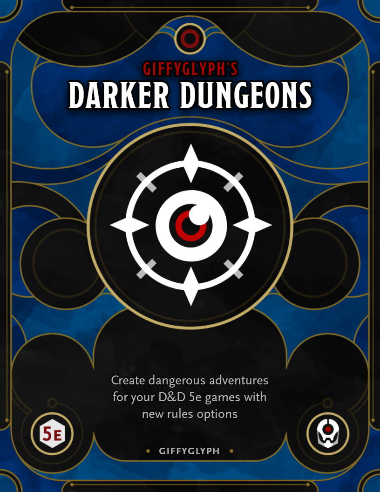
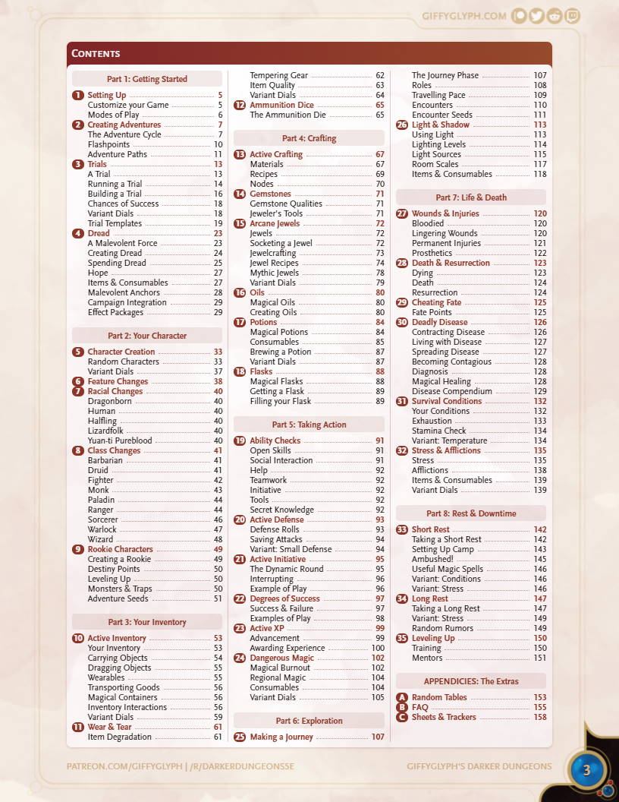

# Giffyglyph's Darker Dungeons

Is life too easy for your D&D 5e players? Want to add some _immersive_ rpg mechanics to your campaigns? Then try **Giffyglyph's Darker Dungeons**—200+ pages of modular rules, advice, templates, and character sheets compatible with any 5e game. Create a dark and dangerous world!

* [Read the Latest PDF (v4.0.0)](https://github.com/giffyglyph/giffyglyphs-darker-dungeons/raw/master/releases/giffyglyphs_darker_dungeons_v4_0_0.pdf)
* [Read the Changelog](https://github.com/giffyglyph/giffyglyphs-darker-dungeons/blob/master/docs/CHANGELOG.md) 

## Features

* Build and run skill challenges with ease using **Trials**.
* Track character equipment with **Inventory Slots and Bulk**.
* Run 0th-level adventures with **Rookie Characters**.
* Let your players craft items with **Active Crafting**.
* Upgrade your weapons and armor with socketable **Arcane Jewels**.
* Coat your gear with **Magical Oils**.
* Track hunger, thirst, and fatigue with **Survival Conditions**.
* Add lingering **Wounds and Injuries** to give combat some lasting consequences.
* Push characters to their breaking point with **Stress and Afflictions**.
* Spread sickness in your world with **Deadly Diseases**.
* Turn long-distance travel into an adventure with the **Journey Phase**.
* Add some risk to spellcasting with **Magical Burnout**.
* Keep your players engaged during combat with **Active Defence** and **Active Initiative**.
* Use **new character sheets** to track your progress.
* And more.

| Cover                                                    | Chapters (v4.0.0)                                           |
| -------------------------------------------------------- | ----------------------------------------------------------- |
|  |  |

## Roadmap

To see what's being worked on right now—and what may be planned for the future—check out the **[projects board](https://github.com/giffyglyph/giffyglyphs-darker-dungeons/projects)**.

## Bugs and Feature Suggestions

If you notice a bug or have a feature suggestion, visit the **[issue board](https://github.com/giffyglyph/giffyglyphs-darker-dungeons/issues)** and open a ticket. Please make sure to be as thorough as possible in your report and attach screenshots where appropriate, as low-effort tickets may be closed out-of-hand.

## Support

If you'd like to see more from this project in future, please consider [becoming a patron](https://www.patreon.com/giffyglyph). You can also find more of my work at:

* [giffyglyph.com](https://giffyglyph.com)
* [twitter](https://twitter.com/giffyglyph)
* [twitch.tv/giffyglyph](https://twitch.tv/giffyglyph)

## Licensing

This work is licensed under a [Creative Commons Attribution-NonCommercial-NoDerivatives 4.0 International License](http://creativecommons.org/licenses/by-nc-nd/4.0/).